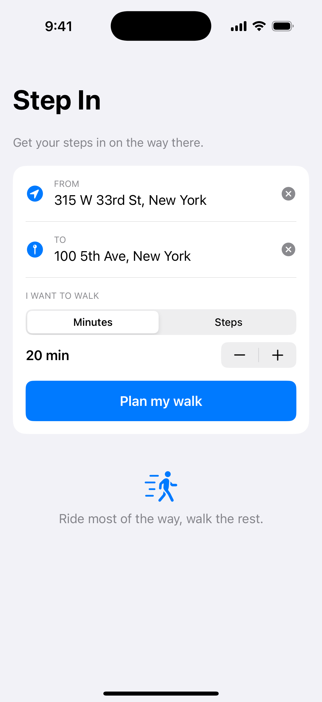
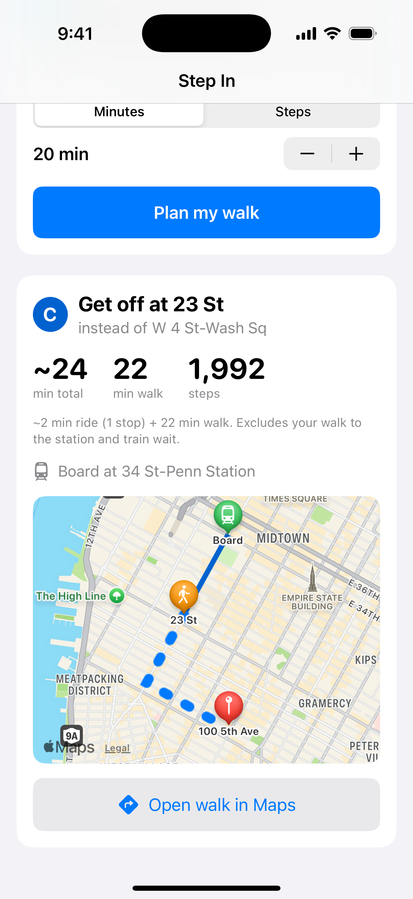

# Step In

*Get your steps in on the way there.*

Ride most of the way, walk the rest. A native iOS app for NYC that plans a
subway trip and tells you **which stop to get off at** to hit a walking goal —
"I want to walk 20 minutes" or "I want 4,000 steps."

> From 315 W 33rd St to 100 5th Ave, 20 minutes → *"Take the C, get off at
> 23 St (instead of W 4 St), ~24 min total."*

| Say where you're going + your walk goal | Get off early, walk the rest |
| :---: | :---: |
|  |  |

## Why this exists

Google Maps and Apple Maps route you to the *closest* stop and the *shortest*
walk. But sometimes you *want* to walk — to hit a step goal, clear your head, or
just move. Step In flips it around: tell it how far you want to walk, and it
finds the stop to get off at so the last leg is exactly that. You still get where
you're going; you just arrive with your steps in.

## How it works

- **Transit brain — bundled MTA subway GTFS.** Apple's MapKit can't do transit
  routing, so the line/stop knowledge comes from the official MTA feed, distilled
  into `StepIn/Resources/mta_subway.json` (stations + per-line stop sequences,
  express vs. local preserved). Free, offline, no API keys.
- **Walking — MapKit.** Real walking times/distances, the map, geocoding, and
  place autocomplete come from MapKit.
- **The idea:** find the line you'd actually board (nearest your origin heading
  toward the destination), then walk *backward* along it from the natural nearest
  stop until the remaining walk matches your target.

## Project layout

```
Scripts/build_mta_data.py   # download + distill the MTA GTFS feed
StepIn/Models/              # WalkTarget, SubwayGraph, Journey
StepIn/Services/            # Geocode, Walk (MapKit), autocomplete, TransitPlanner, GetOffEarlyPlanner, PlannerModel
StepIn/Views/               # PlanView, AddressField, RoutePreviewMap, SubwayLineBadge
StepInTests/                # pure-logic unit tests (no simulator/network)
```

## Build & run

Requires Xcode and [XcodeGen](https://github.com/yonaskolb/XcodeGen).

```bash
python3 Scripts/build_mta_data.py      # refresh bundled subway data (optional)
xcodegen generate
xcodebuild -project StepIn.xcodeproj -scheme StepIn \
  -destination 'platform=iOS Simulator,name=iPhone 16 Pro' build
```

Open `StepIn.xcodeproj` in Xcode and run, or `xcodebuild ... test` for the unit
tests.

## Scope

**v1** handles single-line trips (no transfer), which covers most short Manhattan
commutes. Later: one-transfer trips, GTFS-realtime arrivals, HealthKit stride
personalization.
